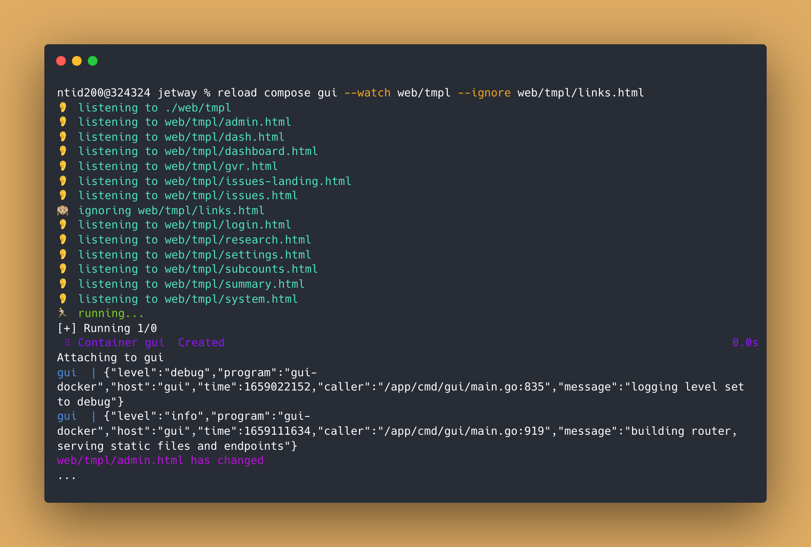

# Reload
Reload is a CLI tool written in Golang to enable live reload functionality for both containerized and non-containerized applications in the hopes of streamlining developer productivity and promoting rapid iterative development on all applications.



## Installation (from source)
```shell
git clone https://github.comcast.com/SPEG-PP/Reload <somewhere>
cd <somewhere>
make build
make install
```

Then verify that `reload` was installed correctly:

```shell
reload --help
```

## Features
- Live reload support for containerized (i.e. `docker`, `docker compose`) and non-containerized workflows
- Say bye 👋 to the long list of flags with a `reload.toml` file, and start your live reload with 3 words
- Automagically reject `.env`, plaintext, markdown, `.log`, and Go test files without having to specify an `--ignore` flag for it

## Basic Usage

```shell
reload [flags]
reload [command]
```

**Available Commands**:
```shell
  init          Generates a minimal reload.toml file with two example workflows
  start         Run a custom workflow defined in the reload.toml file (no more nasty flags 🤮)
  compose       Adds live reload functionality to Docker services via docker-compose.yml
  help          Helpful usage information
```

**Flags**:
```shell
  -b, --build   strings       Shell command to build your project
  -r, --run     string        Shell command to run/server your project
  # below are global flags that apply to all available commands
  -p, --path     string       Path to watch files from (default ".")
  -w, --watch    strings      Files/directories to watch (relative to --path) 
      --ignore   strings      Files/directories to ignore (relative to --path)
  -v, --verbose  boolean      Display build and run output to the console as well as other logs
```

### `init` usage

```shell
reload init
```

### `start` usage
> Note: Make sure your `reload.toml` is defined and configured with the correct info for your workflow. 
> Check out the sample [reload.toml](reload.toml) file for configuration details

```shell
reload start [workflow]
```

### `compose` usage
> Note: Make sure your `docker-compose.yml` file is defined

```shell
reload compose [service] [flags]
```

**Flags**:
```shell
  -v, --verbose  boolean      Displays docker-compose logs to the console 
  # global flags
  -p, --path     string       Path to watch files from (default ".")
  -w, --watch    string       Plain old shell command
      --ignore   strings      Files/directories to ignore (relative to --path)
```

## Examples

**SAM CLI (Jetway)**
```shell
reload \ 
  --path <jetway root directory> \
  # file/dirs to watch
  --watch internal/handlers \
  --watch internal/common \
  --watch internal/database/db.go
  # files/dirs to ignore
  --ignore internal/common/errors.go \
  # build commands 
  --build "sam build" \
  --build "echo build succeeded!" \
  # run command
  --run "sam local start-api --host <host> --port <port>"
```

**GUI Service (Docker Compose)**
```shell
reload compose gui \ 
  --path <jetway root directory> \
  # file/dirs to watch
  --watch web/tmpl
  --watch web/static
  --watch cmd/gui
  # files/dirs to ignore
  --ignore web/static/img
  --ignore cmd/gui/README.md
  --ignore cmd/gui/gin.log
  --ignore cmd/gui/gui-docker
```

## Roadmap
- [x] Add support for running via config file (here is a [sample file](reload.toml))
- [x] Spice up the UI/UX with [colors](https://github.com/fatih/color)
